# DIRC based on PicoRV32 (for FPL2021 Blind Review)
## 1 Introduction
DIRC (**D**ataflow **I**ncremental **R**efinement of **C** code) is a top-level 
tool, that allows the developers migrate applications from pure software to hydrid-
or pure-hardware running on the FPGAs. 
This is a temporary anonymous repo for DIRC with [picorv32](https://github.com/cliffordwolf/picorv32) support.
We will release it as an open-source repo if the paper could be accepted.
DIRC is based on Vivado and RISC-V 
tool chains. When C++ application are developed in the form of dataflow computational 
graph, DIRC can map streaming operators within the application too a pre-defined 
overlays and performs fast compilation. As an initial functional implementation, 
DIRC can map the C/C++ applications to RISC-V cores clusters within seconds for 
quick functionality verfication and debugging. After that, the users can change 
the operators mapping targets by only changing some pragmas, the DIRC can compile 
only the changed operators in parallel. DIRC can run both on local machine and 
google cloud platform (GCP). When run DIRC on the local machine, the Makefile 
can explore the maximum parallelism  by the maximum local threads. When running 
the DIRC on the google cloud platform, we use SLURM as the scheculer to parallel 
independent compilation jobs. In the following section, we will show you how to 
use DIRC for incremental development by mapping **Optical Flow** from [Rosetta Benchmark](https://github.com/cornell-zhang/rosetta), 
both with local macine and GCP.

### 1.1 How DIRC works?
To use DIRC to develop the benchmarks, the application code should be written in the form 
of dataflow graph. We take the optical flow example as below.

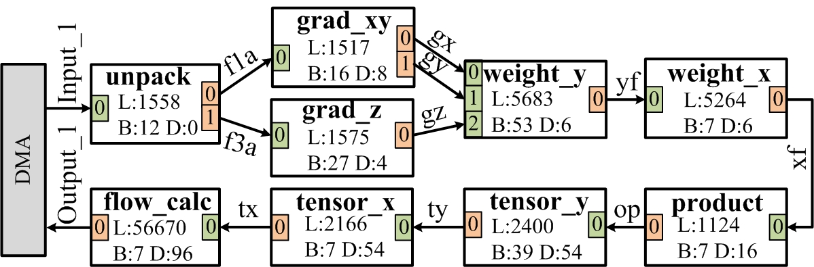  
*(These images aren't coming up inline in the anonymizer; click on the link text to see the image.)*


It has 9 operators. Each operator has an individual .cpp and .h file. The Makefile
will detect wether these .cpp or .h files have been ever changed, and only lauch 
corresponding compilation jobs either locally or on the goole cloud. As the figure
below, all the 9 operators compilations jobs are idependent and can be performed 
in parallel. Accroding to the opertor's header file, the operators can be mapped
to FPGA Fabric or pre-compiled RISC-V cores. As shown in the flow_calc.h Line 3,
flow_calc operator's target is hardware (HW), the flow_calc.cpp will be compiled
by the Vivado_HLS to generate the verilog files. Out-of_context synthesis can compile
the Verilog files into DCP files. The overlay is pre-compiled DCP, which are
equipped with RISC-V cores on all the Partical Reconfigurable pages. It obay the 
normal partial reconfigration flow from Xilinx. After the overlay is implemented
(Placed and routed), we empty the paritial reconfigurable pages out, and store the 
corresponding bitstreams as a RISC-V library. 

If the operator target HW, the pragam direvative p_num can specify which leaf to 
map (flow_cal.h L3). The overlay will first be loaded, and fill in the target 
leaf with the flow_calc.dcp and do the placement and routing under the context of
the overlay. After that, the partial bitstream will be generated.

If the operator taget is riscv, the tersor_x.cpp will be passed through RISC-V
tool chain and generate the ELF (Executable and Linkage File) without any hardware
compilation. It usually takes around seconds.    


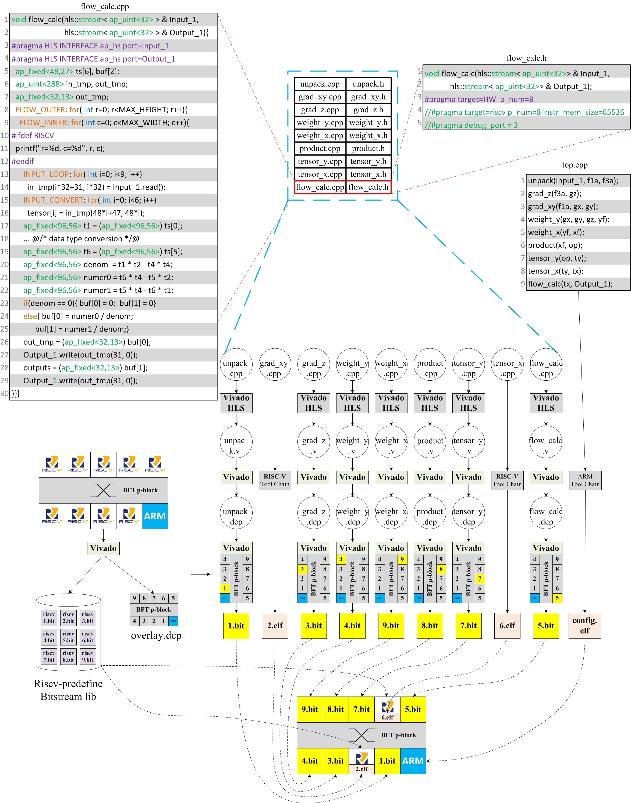


## 2 Tool Setup

### 2.1 SDSoC Preparation
Due to Rosetta Benchmark is based on some libraries (hls_video.h, ect.), which are stripped off by the latest
Vitis_HLS, we still develop the demo with [SDSoC 2018.2](https://www.xilinx.com/support/download/index.html/content/xilinx/en/downloadNav/vitis/archive-sdsoc.html) 
and target the [ZCU102 board](https://www.xilinx.com/support/documentation/boards_and_kits/zcu102/ug1182-zcu102-eval-bd.pdf).
As the partial reconfiguration shell is released recently , we will move on to Vitls_HLS
soon.

### 2.2 RISC-V Tool Praparation

The RISC-V toolchain is based on picorv32 repo. You can install the RISC-V toolchain with 
this commit tag (411d134).
We copy the installation guide from [picorv32](https://github.com/cliffordwolf/picorv32) 
as below.

    # Ubuntu packages needed:
    sudo apt-get install autoconf automake autotools-dev curl libmpc-dev \
            libmpfr-dev libgmp-dev gawk build-essential bison flex texinfo \
	    gperf libtool patchutils bc zlib1g-dev git libexpat1-dev

    sudo mkdir /opt/RISC-V32i
    sudo chown $USER /opt/RISC-V32i

    git clone https://github.com/RISC-V/RISC-V-gnu-toolchain RISC-V-gnu-toolchain-rv32i
    cd RISC-V-gnu-toolchain-rv32i
    git checkout 411d134
    git submodule update --init --recursive

    mkdir build; cd build
    ../configure --with-arch=rv32i --prefix=/opt/RISC-V32i
    make -j$(nproc)


## 3 Benchmark Preparation
1. To get our [Makefile](./Makefile) to work, you need to copy your application cpp
code to certain directory. We take 
**Optial Flow** as an example.
2. You can create the directory [optical_flow](./input_src) with the same 
name as the benchmark under '**./input_src**'.
3. We create one cpp file and one header file for each operator. In 
[./input_src/optical_flow/operators](./input_src/optical_flow/operators), we
can see 9 operators to be mapped to partial reconfigurable pages.
4. We can set the page number and target (HW or RISC-V) in the header file
for each [operator](input_src/rendering/operators/data_redir_m.h).

```c
    #pragma map_target = HW page_num = 3 inst_mem_size = 65536
```

5. Currently, we use a **top** function in [./input_src/optical_flow/host/top.cpp](./input_src/optical_flow/host/top.cpp)
to show how to connect different operators together. Our python script 
([config.py](./pr_flow/config.py)) will
parse the top.cpp and operator header files to extract the interconnection,
and generate the configuration packets.
 

## 4 Tutorial 1: Local C Simulation
1. We can start from the local C++ code. Go to [./input_src/optical_flow](./input_src/optical_flow).
2. In the [Makefile](./input_src/optical_flow/Makefile), we need to modify the 
include path, which corresponds to the your installation path.

```c
INCLUDE=-I /opt/Xilinx/Vivado/2018.2/include 
```

3. type **make** do simulate the source C++ code with gcc. You should see the results as below.

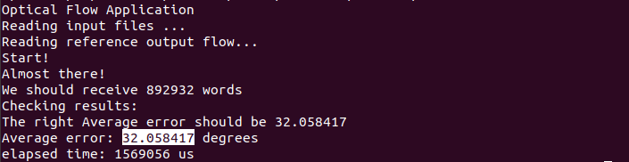


## 5 Tutorial 2: Initial Hardware Implementation
1. After the C++ implementation, we will launch our first trial to map the 9 operators
to hardware page.

2. Type **make report**, you can see the each operator is mapped to one physical 
page, but currently, no hardware implementation details are available.
The overlay size is as below.

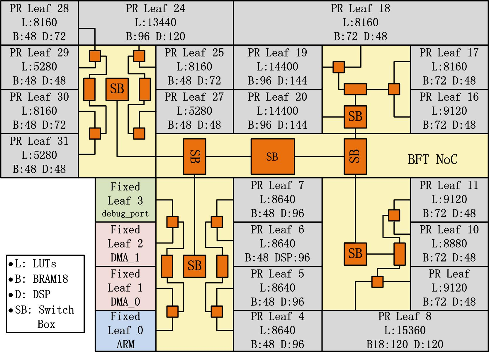

3. As you set the vivado properly, we need to set the **Xilinx_dir**, which represents
the vivado installtion diretory in 
[./common/configure/configure.xml](./common/configure/configure.xml).

```c
  <spec name = "Xilinx_dir" value = "/opt/Xilinx/Vivado/2018.2/settings64.sh" />
```

4. In the [Makefile](./Makefile), change the **prj_name** to **optical_flow**.

```c
    prj_name=optical_flow
```

5. Now we are ready to launch the first hardware implementation trial. Type 
**make -j$(nproc)** to take advantage of multi-threads of your local CPU.
However, you need to have enough DDR memory to explore the parallel compilation.
The safe ratio between DDR memory and CPU threads is 4 GBs/threads. For example, 
if you have 8 threads-CPU, the safe DDR memory size is around 32 GBs. 

6. After all the compilations are done, we can see one of the pages (flow_calc) 
consumes 56,683 LUTs, and is too big 
to be mapped. By typing **make report**, you can see the detailed implementation information in the terminal.
You can also read the report under **./workspace/report**.

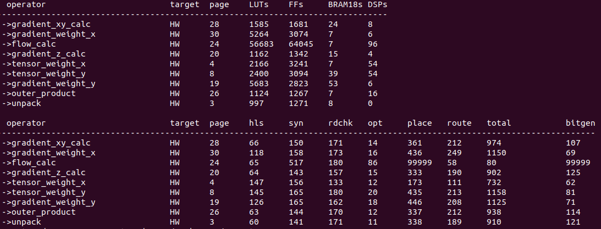


## 6 Tutorial 3: Map all the operators to RISC-V
1. The 20 partial reconfigurable pages are pre-loaded with one picorc32 cores.
To make sure the RISC-V core can run 'ap_int.h' and 'ap_fixed.h', the 
smallest bram size it 65536 Bytes. We could easily map 9 opertors out of 20
pre-load 16 RISC-V cores.

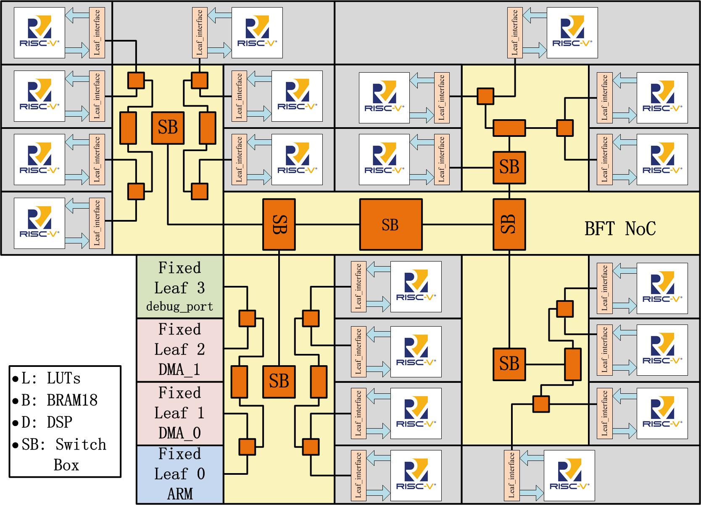

2. We are going to switch '**data_redir**' page to RISC-V. To achieve
this goal, we only need to avoid downloading any partial bitstreams to
page 3 and use ARM to send instruction data through BFT to the pre-loaded
RISC-V core. 

3. As the user, we need to change the pragma in [operators' header files](./input_src/optical_flow/operators).

```c
    #pragma map_target = riscv page_num = 3 inst_mem_size = 65536
```

4. As we have alread set the RISC-V toolchain before, we need to specify the 
**riscv_dir** feature.

```c
<spec name = "riscv_dir" value = "/opt/riscv32" />
```

5. By typing **make -j$(nproc)**, the RISC-V elf file will be compiled automatically.
Type **make report**, you can see the comipile time details in the terminal.

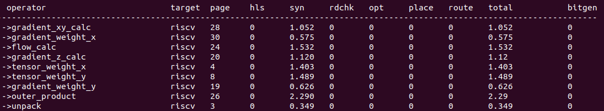

6. As all the RISC-V ELF files are ready, we can launch the soft-run with Xilinx SDK. 

```c
    # copy the hdf file to specific dir:
    mkdir -p ./workspace/sdk
    cp ./common/overlay/floorplan_static_wrapper.hdf ./workspace/sdk/
```

7. Launch sdk 2018.2, specify the workspace directory to the DIR with the 'floorplan_static_wrapper.hdf'
as below.

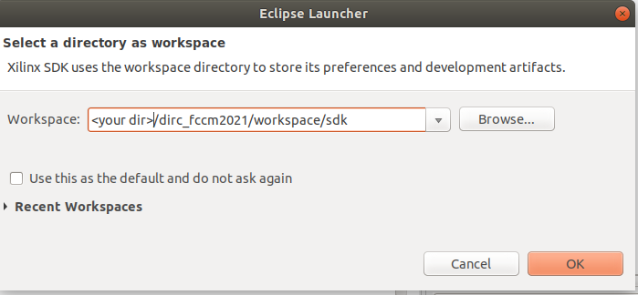

8. Create an application projets as below.

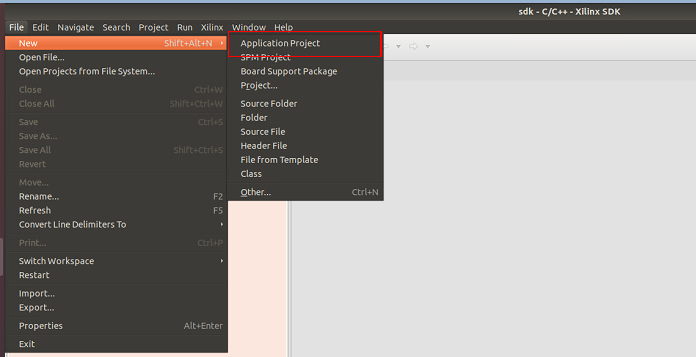

9. Click **new** to specify the hdf file.

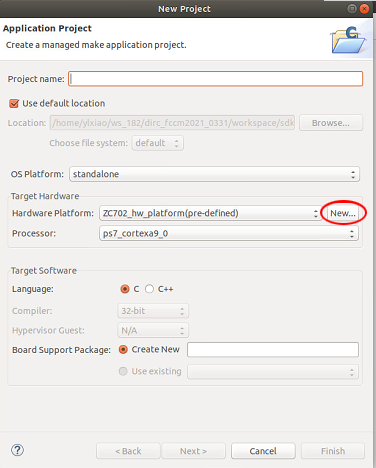

10. Click **new** to specify the hdf file directory as below.

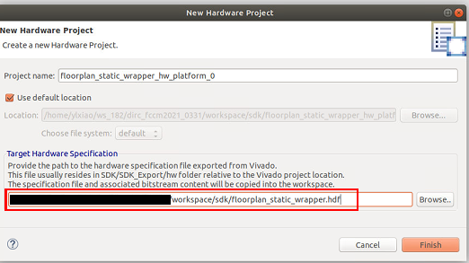

11. Create the application with the same name as the benchmark.

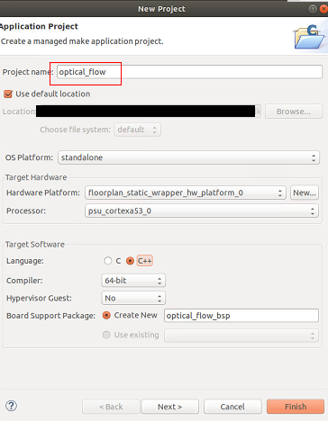

12. Type '**Make config**", the instr_data will make copied to Vitis project,
and the cpp source will also be updated.

13. Fresh the source files. If you set the sdk application projets with the right
direcotry and name, you should see the source files are updated automatically by 
previous step.

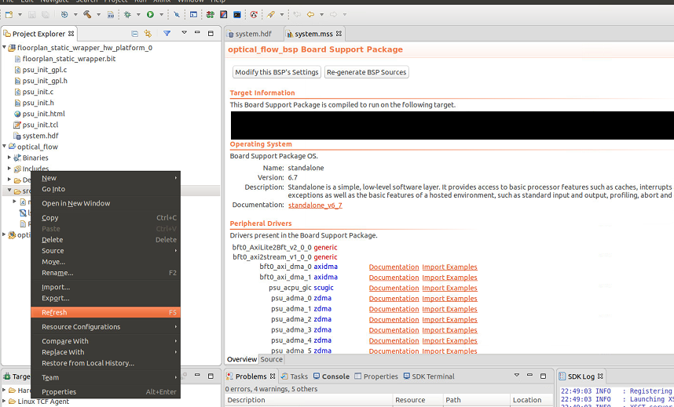


14. Type '**Make download**' to download the bitstreams into the board,
and launch the SDK project to run the project. You can see the results
with one page running on the RISC-V core.

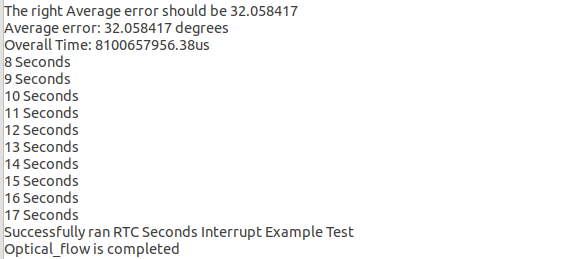


## 7 Tutorial 4: More Debugging Features for RISC-V implementation
1. We can enable the print features by changing the 
[./input_src/optical_flow/operators/flow_calc.cpp](./input_src/optical_flow/operators/flow_calc.cpp)
as below. The **print_str** and **print_dec** are the functions in the RISC-V firmware.

```c
#ifdef RISCV
      print_str("r=");
      print_dec(r);
      print_str("\n");
#endif
```

2. Compile the projects again by steps below.

```
    # re-compile RISC-V cores
    make -j$(nproc)
    make config
    make download
```

3. Go back to the SDK projects can re-launch the ARM run. You can see the debugging
information as below. We can see it takes around 18 seconds to process one rows of
frames. We will use faster RISC-V cores to accelerate the image processing in the future.

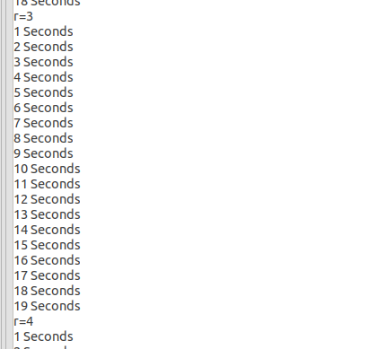


## 8 Tutorial 5: Map all Operators to Hardware

1. By looking into the **flow_calc** operator in Figure 1, we find the nested 
loop calculation is suitable for data-parallelism. Especially, **buf[0]**
and **buf[1]** are completely independent (L24--26).  Therefore, we can 
split the computation into two operators. 
Consequently, we can also easily split the upstream 
operators **tensor_y**, **tensor_x**, **product**, **weight_x**,
 **weight_y** in similar way, so that we can benefit from smaller
pages to accelerate the compilation time.
For operators **unpack**, **grad_xy**, **grad_z**, we 
can see they are small, and  
we can merge them into one operator without
harming the performance.
As we split each operator, we can
compile it quickly in 2 s and run the split design on the softcore
processors along with the already FPGA-page-mapped operators to validate
functionality.  
After decomposing and merging the operators, we have 16  operators that all fit
on the pages on our overlay, and the entire design runs on FPGA logic.  

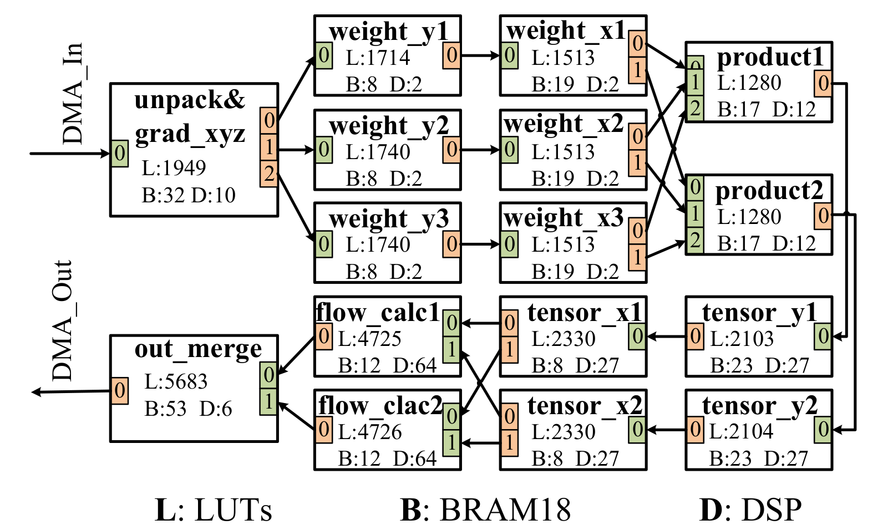


3. We have our decomposed C++ code under [./input_src/optical_flow_final/](./input_src/optical_flow_final).
We can change the project name to **optical_flow_final**.

```c
prj_name=optical_flow_final
```

4. Type '**Make -j$(nproc)**'. It will generate all the necessary DCP and 
bitstream files automatically. Different operators can be compiled in 
parallel according to the thread number of your local machine. Be carefull
with the memory requirements, when you use multi-threads to compile the 
project. When I use 8 threads to compile, I at least need 32 GB DDR 
memory.

```c
Make -j$(nproc)
```


## 6 Mapping Report
Type '**Make report**', you can find the compile and resource report under 
'workspace/report'.


